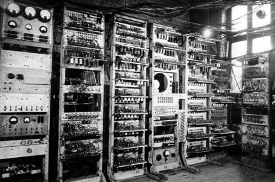
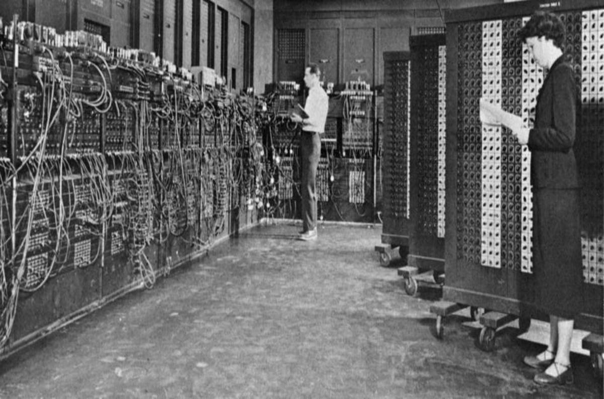
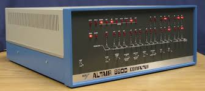
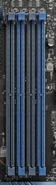
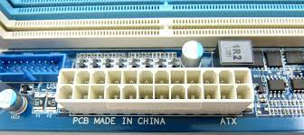
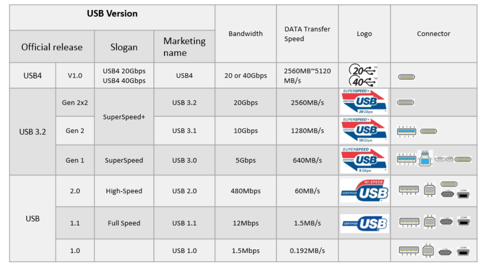

# Hardware. Introducción.

1.  **Antecedentes históricos**

Como todos sabemos el instrumento básico de la informática es el ordenador, o computador (palabras absolutamente equivalentes), instrumento capaz de efectuar cálculos y elaborar datos con extraordinaria rapidez y fiabilidad, pero incapaz de generar información nueva si previamente no se le ha indicado como conseguirla. Por ello, quien se aproxime por primera vez a la informática debe desterrar, como primer acto de mentalización, la abundante mitología sobre ciertas supuestas capacidades casi mágicas de los ordenadores.

Un ordenador solo puede hacer dos cosas: ejecutar secuencias de operaciones, y optar entre secuencias alternativas cuando esta posibilidad ha sido prevista.

Los antecedentes del ordenador se pueden remontar, quizá, al ábaco y, en épocas algo más modernas, a las máquinas de Pascal, Leibnitz, Babbage, Hollerith, la tarjeta perforada, etc. que encontrarás descritas en cualquier buen libro de introducción a la informática. Pero los primeros ordenadores, en sentido estricto, fueron construidos al final de la década de los cuarenta, confines militares principalmente.

 **MARK-1**

Los primeros ordenadores fueron el ASCC (Automatic Sequenced Controlled Calculator), también conocido como Mark I, que fue la primera máquina de calcular totalmente automática, aunque de funcionamiento mecánico, que entró en funcionamiento en 1944, y el ENIAC (Electronic Numerical Integrator and Calculator), que en 1946 se puso en marcha y fue el primer ordenador electrónico, basado en las válvulas termoiónicas, que desplazaron definitivamente al relé y a la rueda de contador. Fue lo que se llamó Primera Generación de ordenadores.

 **ENIAC**

Acabando los 50, se introdujo un elemento revolucionario que cambiaría muchos aspectos de la vida: el transistor, dando así pasó a la era electrónica. En pocos milímetros cúbicos se podían meter más componentes que antes en decímetros. Con ellos, junto con el núcleo de ferrita, surge la Segunda Generación de ordenadores, mucho más compactos y manejables. Nacen también los lenguajes de programación algo más próximos al lenguaje humano. Hasta ese instante se había programado exclusivamente en lenguaje máquina.

  **Transistor vs. Válvula de vacio**     
  **Primer transistor**

!!! info 
    El primer transistor se desarrollo en los laboratorios Bell en 1947

A finales de los 60 el transistor comienza a dar paso a los circuitos integrados, en los que los componentes llegan a extremos increíbles de microminiaturización, permitiendo ordenadores más y más compactos, potentes, seguros y baratos. Es la Tercera Generación, que también ve llegar los lenguajes de programación de alto nivel.

 **Primer circuito integrado**
 **Circuitos integrados**

Como ocurre siempre, nos falta perspectiva para poder definir el momento en el que nos hallamos, el de la cuarta generación o incluso quinta, que quizá no se defina por sus elementos materiales, aunque estos hayan progresado de manera extraordinaria, sino por el cambio experimentado en la forma de ver la relación de los usuarios con las máquinas, por la enorme difusión de los ordenadores, por la extraordinaria gama de soluciones a problemas de cálculo y de gestión, y por la superación de la anteriormente infranqueable pared divisoria entre los profesionales de la informática y el conjunto de los usuarios.

1. **Breve historia de los ordendores personales.**

* Los ordenadores personales nacieron con el objetivo de acercar los ordenadores a pequeñas empresas y a los hogares.
* Un primer acontecimiento importante ocurría en 1971 : Intel desarrollaba el microprocesador 4004. Se trataba de un procesador de 4 bits. La misma empresa anunció el lanzamiento de un chip de memoria RAM de 1 Kbit.  **Intel 4004**
* En 1972, Intel lanzó los procesadores 8008 y 8080, en este caso de 8 bits y capaces de acceder a 16 KB de memoria. El microprocesador 8080 dio lugar a diversos desarrollos, como es el caso del ordenador Altair 8800 , que alcanzó un gran éxito. Esta máquina carecía de teclado y pantalla (tan solo presentaba interrupciones y luces, pero su arquitectura basada en la conexión de tarjetas dio lugar al bus estándar S-100 más tarde. En 1975 ya se había presentado una implementación del lenguaje BASIC para el ordenador Altair (hecho en el que Bill Gates tuvo una importante participación). Otros ordenadores que se diseñaron a partir del procesador 8080 fueron IMSAI 8080 y Mark-8. 
  
 **Altair 8800** 
* En 1976, Intel anunciaba su nuevo procesador 8085, capaz de trabajar a 5 Mhz y con un bus de 8 bits. Por su parte , Zilog Introducía el procesador Z80, basado en el 8080 de Intel. Ese mismo año, MOS Technology introduce el procesador 6052. Basado en este procesador, se lanza el Apple-1, que fue después sucedido por el Apple II.  **Apple II**
* En la década de los 80 imperaban ordenadores personales como ZX-Spectrum (sucesor del ZX-80 y ZX-81, creados por Sir Clive Sinclair). Commodore lanzó su VIC-20, y posteriormente el Commodore 64 (a partir del procesador 6052). Estos ordenadores se basaban en procesadores de 8 bits y manejaban un máximo de 64 KB de memoria. Amstrad ( con su CPC) y los ordenadores MSX intentaron rebasar ese límite, manteniendo los chips empleados, pero no lograron el éxito deseado.  **ZX-Spectrum**
  

a) ***El nacimiento del PC***

El PC fue introducido en 1981 por IBM. Se presentaba como un ordenador personal basado en el microprocesador Intel 8088, de 16 bits. Este primer PC constaba de 16 KB de memoria, ampliables a 64 ó 256 KB. El almacenamiento externo se realizaba mediante cintas de casette, que después se transformaron en unidades de disco de 5 1⁄4 pulgadas.
En 1983 se lanza el IBM PC-XT cuya principal novedad era un disco duro de 10MB. En 1984 aparece el IBM PC-AT, basado en el nuevo procesador 286. Ofrecía ranuras de expansión de 16 bits (empleando el estándar ISA) y 20 MB de disco duro. Todos los sucesores de dicho ordenador quedan dentro de la categoría AT, aunque actualmente se hace referencia a ellos bajo el nombre de PC.
El IBM PC-AT experimenta un gran éxito en los siguientes años. En 1986, IBM lanza la siguiente generación de ordenadores PC, esta vez basados en el procesador 386. Con aquel procesador la competencia empezó a adelantarse a IBM.
A continuación, el PC sigue su evolución, alcanzando un éxito espectacular: está presente en infinidad de hogares y empresas de todo tipo, y mueve un mercado de software sin precedentes. Cada nueva generación del PC viene definida por una nueva versión de un procesador Intel: 486, Pentium, Pentium II, Pentium III , Pentium IV, ect. Ver cuadro siguiente.

| **Año** | **Intel** | **AMD** | **Motorola**
|-------------|-------------|-----------|----------|
| 1971 | Intel 4004 | - | - |
| 1972 | Intel 8008 | - | - |
| 1978 | Intel 8086 | - | Motorola MC 6800 |
| 1979 | Intel 8088 | - | - |
| 1982 | Intel 80286 | - | Motorola MC 68020 |
| 1985 | Intel 80836 | AMD80386 | Motorola MC 68030 |
| 1989 | Intel 80846 | AMD80486 | Motorola MC 68040|
| 1993 | Intel Pentium | - | Motorola MC 68060 MIPS R10000 |
| - | - | - | - |
| 2010 | Intel Core i3, i5 e i7 1ª generación (Nehalem) | - | - |
| 2011 | Intel Core i3, i5 e i7 2ª generación (Sandy Bridge) | - | - |
| 2012 | Intel Core i3, i5 e i7 3ª generación (Ivy Bridge) | AMD FX (Bulldozer) | - |
| 2013 | Intel Core i3, i5 e i7 4ª generación (Haswell) | APU’s de AMD | - |
| 2014 | Intel Core i3, i5 e i7 5ª generación (Broadwell) | - | - |
| 2015 | Intel Core i3, i5 e i7 6ª generación (Skylake) | - | - |
| 2016 | Intel Core i3, i5 e i7 7ª generación (Kaby Lake) | - | - |
| 2017 | Intel Core i3, i5 e i7 8ª generación (Coffee Lake) e Intel Core i9 | Primera generación Ryzen 3, 5 y 7 (Summit Ridge). Zen | - |
| 2018 | Intel Core i3, i5, i7 e i9 de 9ª generación (Coffee Lake Refresh) | Segunda generación Ryzen (Pinnacle Ridge). Zen+ | - |
| 2019 | Intel Core i3, i5, i7 e i9 de 10ª generación (Ice Lake) | Tercera generación Ryzen (Matisse). Zen2 | - |
| 2020 | Intel Core i3, i5, i7 e i9 de 11ª generación (Tiger Lake) | Cuarta generación Ryzen (Renoir). Zen3 | - |
| 2021 | Intel Core i3, i5, i7 e i9 de 12ª generación (Alder Lake) | Quinta generación Ryzen (Vermeer). Zen3 | - |
| 2022 | Intel Core i3, i5, i7 e i9 de 13ª generación (Raptor Lake) | Sexta generación Ryzen (Rembrandt). Zen3+. Séptima generación Ryzen (Raphael AM5). Zen 4. | - |
| 2023 | ntel Core i3, i5, i7 e i9 de 14ª generación (Raptor Lake Refresh). Intel Core Ultra 5 y 7 Series 1 (Meteor Lake-PS)| - | - |
| 2024 | Intel Core Ultra 5, 7 y 9 Series 1 y 2 (Arrow Lake) | Octava generación Ryzen (Phoenix). Zen 4.Novena generación Ryzen (Granite Ridge). Zen 5. | - |

2.  **Estructura física de un ordenador.**
   
    2.1.  **Unidad principal de sistema.**

La imagen más elemental y corriente de un ordenador personal es la de una máquina que se puede colocar encima de un escritorio y que está integrada básicamente por un monitor, un teclado y una caja más o menos grande, horizontal o vertical que recibe el nombre de Unidad Principal de Sistema (y que contiene los elementos electrónicos de procesamiento de la información). Coloquialmente se le llama “torre” (si esta dispuesta verticalmente) o “caja” (si esta colocada horizontalmente). Además del teclado y del monitor, fuera de la Unidad Principal de Sistema, también podemos encontrar otros dispositivos (impresora, ratón, escáner, micrófono, altavoces, etc.) llamados periféricos, que permiten realizar distintas tareas y trabajar con imágenes, voz, texto y/o vídeo.
Así pues los componentes básicos de un ordenador son la Unidad Principal de Sistema y los periféricos. Éstos, como ya hemos comentado, son los dispositivos que conectan los elementos electrónicos internos (que constituyen el corazón de la máquina) con el exterior. Hay cuatro tipos de periféricos distintos: de entrada (como teclado, ratón, joystick, micrófono, escáner), de salida (monitor, impresora, altavoces), de entrada/salida (como el módem) y de almacenamiento masivo (como los discos flexibles de alta capacidad). Para conectarse a estos periféricos el ordenador debe tener ciertos dispositivos, como CD-ROM, tarjetas de sonido, tarjeta gráfica, de vídeo, tarjeta de red, etc. y los programas apropiados.

En el interior de la Unidad Principal de Sistema podemos encontrar los siguientes componentes principales:

* ***La fuente de alimentación:*** Es un transformador eléctrico que regula la electricidad que va a utilizar el ordenador. Convierte la corriente alterna que suministra la red eléctrica en bajos voltajes de corriente continua con los que puede funcionar el ordenador (habitualmente 3,3 voltios, 5 voltios y 12 voltios). Los dos primeros voltajes son los que utilizan ordinariamente los circuitos digitales, mientras que 12 voltios es el voltaje que se usa para poner en marcha los motores del disco duro y del ventilador.
* ***Los ventiladores:*** Tienen como misión sacar fuera de la unidad del sistema el calor generado por el funcionamiento del microprocesador, de algunas tarjetas de vídeo, así como el generado por la fuente de alimentación. Las salidas se encuentran junto a la fuente de alimentación.
* ***Placa base:*** Es un chip de silicio que contiene un procesador microscópico. El procesador para trabajar a una determinada velocidad es controlado por un reloj. De él depende no sólo la velocidad, sino también la fiabilidad de las operaciones que efectuemos en nuestro ordenador. El microprocesador se conecta a la placa base y ambos tienen que estar conjugados (cualquier microprocesador no puede insertarse en cualquier placa)
* ***Microprocesador:*** Es el centro del ordenador, físicamente es la superficie sobre la que se conectan los circuitos y componentes de la unidad central.
* ***Memoria base o principal:*** Consiste en una memoria de acceso aleatorio que llamamos RAM, cuya capacidad de almacenamiento se mide en gigabytes.

2.2.  **Placa base.**  

La placa base, o también llamada placa madre (motherboard), es el componente central de un ordenador. Consiste en un conjunto de circuitos impresos y conectores integrados en una única placa donde se alojan todos los componentes internos del ordenador como el procesador, el chipset, la BIOS, la memoria principal, los chips de entrada/salida, las controladoras de disco, las tarjetas de expansión (gráfica, de red…), y otros.

***a) Zócalos de la placa base para el microprocesador.***

Desde la aparición del 486, las placas base incorporan un zócalo que permite instalar y desinstalar el microprocesador. Cada fabricante de procesadores suele utilizar sus propios formatos y éstos además varían según modelos. Una placa base debe disponer del zócalo (socket o slot) de tipo adecuado, es decir, con el número de patillas (pins) y formato correcto facilitando el voltaje al microprocesador para el que ha sido diseñada.

Los diferentes micros no se conectan de igual manera a las placas:

* Socket, con mecanismo ZIF (Zero Insertion Force). En ellas el procesador se inserta y se retire sin necesidad de ejercer alguna presión sobre él. Al levantar la palanquita que hay al lado se libera el microprocesador, siendo extremadamente sencilla su extracción. Estos zócalos aseguran la actualización del microprocesador. Antiguamente existía la variedad LIF (Low Insertion Force), que carecía de dicha palanca. Hasta hace poco se utilizaba en procesadores AMD básicamente.
 **Socket ZIF** 
* Slot A / Slot 1 /Slot 2. Existieron durante una generación importante de PCs (entre 1997 y 2000 aproximadamente) reemplazando a los sockets. Es donde se conectan respectivamente los primeros procesadores Athlon de AMD / los procesadores Pentium II y primeros Pentium III y los procesadores Xeon de Intel dedicados a servidores de red. Todos ellos son cada vez más obsoletos. El modo de insertarlos es a similar a una tarjeta gráfica o de sonido, ayudándonos de dos guías de plástico insertadas en la placa base.  **Slot A**
* En las placas base más antiguas el micro iba soldado, de forma que no podía actualizarse. Hoy día esto no se ve en lo referente a los microprocesadores de PC.
* Socket LGA: La matriz de contactos en rejilla o LGA (Land Grid Array) es una interfaz de conexión a nivel físico para microprocesadores y circuitos integrados. La interfaz LGA no presenta ni pines ni esferas, la conexión de la que dispone el chip es únicamente una matriz de superficies conductoras o contactos chapadas en oro que hacen contacto con la placa base a través del zócalo de la CPU. Su alineación de pines es vertical y horizontal. Esta interfaz se beneficia por reducir el proceso de fabricación, amén de unas características térmicas, eléctricas y físicas superiores a las interfaces de chips previamente usados. Actualmente se utiliza en procesadores Intel y en los últimos procesadores AMD.

  **Socket LGA**

* AMD:
  * Socket AM4. Zócalo de 1331 contactos para procesadores AMD Ryzen de hasta 5ª generación.
 
  **Socket AM4**

  * Socket AM5. Zócalo de 1718 contactos para procesadores AMD Ryzen de 7ª, 8ª y 9ª generación.

  **Socket AM5**

  * Socket sTR5. Zócalo LGA de 4844 contactos para procesadores AMD Ryzen Threadripper. El zócalo para los procesadores de servidor EPYC es muy similar y se llama SP3.

  **Socket STR5**

* Intel:
  * Intel Socket 1200. Zócalo de 1200 contactos para procesadores Intel de 10ª y 11ª generación.

  **Socket 1200** 

  * Intel Socket 1700. Zócalo de 1700 contactos para microprocesadores Intel de 12ª, 13ª y 14ª generación.

  **Socket 1700**

  * Intel Socket 1851. Zócalo de 1851 contactos para procesadores Intel Core Ultra.

  **Socket 1851**

Los fabricantes de placas indican una lista de procesadores soportados en las especificaciones de su producto. Existen placas multiprocesadores, es decir, que permiten conectar dos o más procesadores. Están destinadas a desarrollar funciones que necesiten más potencia, como los servidores de red, y por lo tanto un poco más caras. Además será necesario incorporar más memoria principal para que el equipo funcione adecuadamente.

***b) Memoria.***

La memoria, al igual que el micro, iba soldada a la placa base en un principio, pero actualmente existen zócalos (slots) o bancos individuales y de diferentes formatos como SIMM , DIMM, DDR, DDR2, DDR3,  DDR4 o DDR5. La placa base determina el máximo de memoria que podremos poner al sistema. En ocasiones ocurre que, aunque tengamos muchos zócalos, no pueden emplearse todas a la vez, ya que son para distintos tipos de memoria incompatibles entre sí.
Actualmente se utilizan 2 tipos, la DDR4 y la DDR5 aunque nos encontraremos equipos antiguos con memorias DDR, DDR2 o DDR3 más lentas y ahora más caras. La DDR4 se utiliza para velocidades FSB de 2133 hasta 5133 Mhz y la DDR5 de 4800 hasta 6400 Mhz. Dependiendo de la velocidad FSB de nuestro procesador elegiremos una u otra ya que los zócalos donde se insertan son distintos.

  **Memoria RAM DDR4**
  **Memoria RAM DDR5** 

 ***c) Ranuras de expansión***

 La placa base incorpora  controladores  para  manejar los periféricos  básicos  como  el teclado, ratón, disco duro, etc. Los que no estén, y necesitemos, deberemos agregarlos mediante tarjetas en las ranuras de expansión. El procesador se comunica con los demás componentes del sistema a través del bus. Este bus se compone de tres elementos: bus de direcciones, el bus de datos y el bus de control. El primero, el de direcciones, indica lugares de la memoria a los que se han de enviar los datos o de donde se han de leer. El bus de datos es el encargado de realizar la transmisión de datos. Y por último, el bus de control dirige toda la circulación de datos. Existen diversos tipos como ISA, PCI, AGP, PCIE y SCSI que veremos posteriormente.

**PCI-Ex:** Este el el tipo de soporte gráfico que existe en la actualidad ya que el antiguo PCI y el AGP no se utilizan. Su ancho de banda máximo es de 16X debido a la gran evolución de los juegos 3D principalmente.

| Versión de PCI Express | Código en línea | Velocidad de transferencia | Ancho de banda (por carril) | Ancho de banda (En x16)
|------------------------| --------------- | ------------ | --------------- | ----- |
| 1.0 |	8b/10b | 2,5 GT/s |	2 Gbit/s (250 MB/s) | 32 Gbit/s (4 GB/s) |
| 2.0 |	8b/10b	| 5 GT/s | 4 Gbit/s (500 MB/s)	| 64 Gbit/s (8 GB/s) |
| 3.0 |	128b/130b |	8 GT/s | 7,9 Gbit/s (984,6 MB/s)	| 126 Gbit/s (15,8 GB/s) |
| 4.0 |	128b/130b | 16 GT/s	| 15,8 Gbit/s (1969,2 MB/s)	| 252,1 Gbit/s (31,5 GB/s) |
| 5.0 |	128b/130b | 32 GT/s	| 31,6 Gbit/s (3938,4 MB/s)	| 504 Gbit/s (63 GB/s) |
| 6.0 |	242b/256b | 64 GT/s	| 64 Gbit/s (7877 MB/s)	| 1008 Gbit/s (126 GB/s) |
| 7.0 | 242b/256b | 128 GT/s | 128 Gbit7s (15754 MB/s) | 2016 Gbit/s (252 GB/s) |

 **Diferentes slots PCI** 

***d) La BIOS (Basic Input/Output System)***

Todas las placas base tienen un chip especial que contiene el software que llamamos BIOS (Basic Input/Output System) o ROM BIOS. El chip de tipo ROM contiene una serie de programas y controladores que sirven para comunicar los componentes del ordenador (hardware) y el sistema operativo. El contenido de la BIOS es lo primero que se carga al encender el ordenador.
Existian diferentes fabricantes como AMI (American Megatrends), Phoenix, y AWARD, ahora cada fabricante diseña su BIOS UEFI mucho más intuitiva de manejar. Los fabricantes de placas base adaptan los chips para que funcionen correctamente con los elementos específicos de cada una.

 **BIOS AWARD**
 **UEFI BIOS DE MSI**

El BIOS Setup es un programa para la configuración del sistema. Generalmente, es un programa a base de menús, al que se accede presionando una combinación de teclas. Esta combinación depende del fabricante y puede ser la tecla SUPR, o combinaciones como Control + ALT + ESC o Control + ESC + Intro.

El programa permite ajustar parámetros de la placa base y del chipset, además de otras cosas, como la fecha, la hora y las contraseñas, la secuencia de arranque y la velocidad de bus del procesador.
Las configuraciones seleccionadas necesitan mantenerse aun cuando apaguemos el ordenador, por lo que se mantiene con la simple energía de una pila en una memoria de mínima capacidad denominada CMOS RAM (Complimentary Metal Oxide Semiconductor RAM).

Una de las funciones más importantes de la BIOS es la realización del POST (Power On Self Test), el cual comprueba el procesador de la computadora, la memoria, el chipset, la placa de vídeo, los controladores de disco, el teclado y otros componentes importantes. El POST utiliza la información grabada en la CMOS RAM para realizar las comprobaciones.

Los mensajes que muestra el POST es lo que vemos en pantalla nada más iniciarse el ordenador.

***e) Conectores de alimentación.***

Para alimentar eléctricamente a la placa base, existe el conector **ATX**.  El ATX consta de un sólo conector de forma rectangular con funciones avanzadas que permiten apagar y encender nuestro equipo mediante software, así como activar y desactivar varios modos de ahorro de energía.

 
 

Conector **EPS**, este conector es el que lleva la alimentación directa al procesador. Generalmente lo podemos ver como un conector de 4 + 4 pines o bien uno de solo 4 pines.

 

***f) Conectores panel trasero.***

Todas las placas disponen en su parte trasera una serie de conectores para la conexión de periféricos o elementos de expansión.

* **UBS/USB 2.0/3.0:** Actualmente todos las placas integran los puertos UBS 2.0 que alcanzan velocidades de hasta 400Mb/Seg (mucho más q los originales UBS a 12Mb/Seg), USB 3.1 gen1 que alcanzan velocidades de 4,8Gb/s, USB 3.1 gen2 que alcanzan velocidades de 10 Gb/s, USB 3.1 gen2x2 que alcanzan velocidades de 20Gb/s. Se utilizan muchísimo para impresoras, escaners, teclados, ratones, webcams y muchas otras cosas por lo que es importante que tenga suficientes.
* **PS/2:** Conector utilizado para teclados y ratones antiguos, las placas base actuales tienen como mucho un conector de este tipo.
* **RJ45:** Conector RJ45 para la conexión a la red. Actualmente son Gigabit Ethernet.
* **Conectores de audio:** Conectores utilizados para la conexión de micrófonos, altavoces y cualquier elemento de sonido. Según el color indica que podemos conectar.
* **Conectores de vídeo:** Las placas actuales suelen disponer de un conector HDMI o DisplayPort, pero podéis encontraros placas con conectores VGA o DVI.

***h) Interfaces de dispositivos***

Las interfaces son un componente esencial en cualquier placa base, ya que son los encargados de transmitir los datos entre los distintos componentes y periféricos de nuestro sistema. Podemos encontrar varios tipos: la que comunica el procesador con el chipset (conocida como FSB o bus frontal), la que comunica el chipset y los distintos componentes de la placa base, etc. Estas interfaces son importantes de cara al rendimiento de nuestro ordenador, ya que aunque tengamos el procesador más potente, si la interfaz no tiene la velocidad suficiente para enviarle los datos que necesita, éste tendrá que esperar y por tanto el rendimiento del sistema bajará notablemente.

Existen muchos tipos de interfaces diferentes y solo este parte daría para un tema muy extenso. Tan sólo se van a citar algunos a modo de ejemplo:

* **La Interfaz Serial ATA (SATA)** se diseñó para sobrepasar los límites de la interfaz Parallel ATA (IDE). La interfaz Serial ATA es compatible con todos los sistemas operativos actuales y ha sustituido a la interfaz PATA. Gracias a esta interfaz, podremos obtener mayores velocidades (inicialmente hasta 150 MBps, actualmente hasta los 600MBps), crear discos duros de mayor capacidad y reducir el consumo eléctrico de las unidades. Además, el cable mediante el cual la unidad se conecta a la placa base es mucho más pequeño (tan sólo tiene siete conectores), lo que ayuda a mejorar la ventilación y es menos sensible a las interferencias, por lo que se podrán crear cables más largos sin ningún problema.
  
**Conector SATA placa base**

* **El Universal Serial Bus (USB)** es un estándar que permite conectar dispositivos Plug & Play externos al ordenador. USB elimina la necesidad de instalar tarjetas que ocupan valiosas ranuras, y reconfigurar el sistema. Esto ahorra importantes recursos, como las interrupciones (IRQs), ya que sólo necesita una interrupción aunque estén conectados varios dispositivos al mismo USB. Los ordenadores equipados con USB permiten la configuración inmediata de los dispositivos que utilizan esta interfaz nada más ser conectados, sin necesidad de apagar o reiniciar el sistema.

**Conector USB placa base**

A diferencia de los puertos paralelo y serie, los conectores USB son pequeños y no necesitan ser sujetados con tornillos. USB constituye una interfaz de 12 Mbps en su versión 1.1 a través de una conexión de cuatro hilos dentro de un cable. El bus soporta hasta 127 dispositivos gracias a que se pueden formar redes de dispositivos a través de concentradores (hubs) de expansión que pueden estar en el ordenador o en otros dispositivos USB, como teclados y monitores; incluso, hay concentradores USB dedicados. Si bien esta capacidad es, en principio, impresionante, hay que considerar que todos los dispositivos tendrán que compartir el mismo ancho de banda de 12 Mbps. O sea, cada vez que se agrega un dispositivo a la cadena, el rendimiento se puede ver afectado.

Prácticamente, todas las placas base fabricadas en los últimos años tienen soporte para USB y, la mayoría de las veces, cuentan con varios puertos. Intel incluyó soporte para esta tecnología desde los ya obsoletos chipsets 430HX para procesadores Pentium.

La versión 2.0 del estándar USB es hasta 40 veces más rápido que el de la versión 1.1   y alcanza tasas de transferencia de 480 Mbps. Los dispositivos usan los mismos cables y enchufes que el estándar 1.1, pero el voltaje será reducido de 3,3 voltios a 400 milivoltios. La versión 3.1 gen del estándar USB es hasta 10 veces más rápido que el de la versión 2.0 y alcanza tasas de transferencia de 4,8Gbps. Para conseguir esta velocidad se le han añadido 5 contactos adicionales. La versión 3.1 gen2 del estándar USB es el doble de rápido que la versión 3.1 gen1 y alcanza tasas de transferencia de 10 Gbps. La versión 3.2 gen 2x2 alcanza velocidades de 20 Gbit/s.

Ahora, USB 4 llega soportando 40 Gbps de ancho de banda, una cifra inmensa que supera con claridad la mayoría de necesidades. Recordemos que 40 gigabits son 5 gigabytes, así que tendríamos hasta 5GB/s de transferencia. En USB 4 no desaparece por completo la fragmentación de opciones, pero que tiene nombres de márketing muy claros: USB4 20Gbps y USB4 40Gbps. Lo más importante del estándar USB 4 es que se basa en Thunderbolt. De forma análoga a Thunderbolt se pueden aprovechar otros protocolos, como son el USB 3.2, el DisplayPort 1.4a (para conectar una pantalla por USB-C) y el PCI Express, con el que podríamos comprar tarjetas gráficas o un SSD NVMe externo, por ejemplo.

**Diferentes versiones de USB y sus características**

* El conector **M.2** se ha diseñado para la conexión de dispositivos de almacenamiento masivo. Esta sustituyendo a la conexión SATA. Este conector es mucho más pequeño que el SATA no necesitamos cables para la conexión. Y los dispositivos que conectamos son mucho más pequeños, discos SSD, que los discos tradicionales. Teniendo múltiples ventajas respecto a estos. Esta conexión utiliza dos tipos de estándares de conexión: el SATAIII de 600 Gbps que no mejora en cuanto a velocidad al interfaz SATA tradicional (ocupa menos espacio, los discos duros son más pequeños, consumen menos energía, etc.) y la conexión NVMe o PCIEx4 que si mejora la velocidad de transferencia hasta los 4GBps y así aprovechamos mejor la tecnología de los discos SSD hasta alcanzar velocidades de lectura secuencial de hasta 3,5GBps y de escritura secuencial de 2,5GBps.

**Conector M2 en placa base**

***g) El chipset***

El chipset es el conjunto de chips que se encarga de controlar algunas funciones concretas del ordenador, como la forma en que interacciona el microprocesador con la memoria o la caché, o el control de los puertos y ranuras de expansión. Este conjunto de chips están soldados a la placa base y manejan todos los buses que funcionan en ésta. Generalmente, cuando hablamos de buses y placas base, estamos hablando del Chipset.

Básicamente, un chipset está conformado por dos chips. Uno, el más importante, se denomina puente norte. Este chip controla el funcionamiento y la frecuencia del bus del procesador, la memoria y el puerto PCIexp. Generalmente, las grandes innovaciones tecnológicas, se implementan en este chip.

El segundo chip es el llamado puente sur, que controla los buses de entrada y salida de datos para periféricos (E/S). Este puente determina el tipo de soporte IDE (ATA 66 o ATA 100, por ejemplo), el bus PCI, y los puertos serie y paralelo. En general, la conexión entre ambos puentes se realiza a través del bus PCI, pero recientemente algunos fabricantes de placas base han empezado a usar buses especiales dedicados que permiten una transferencia de datos directa y sin interferencia entre los dos puentes.

Actualmente en las placas base actuales solo aparece un chipset sur, porque con la integración de circuitos que se ha alcanzado las características del puente norte vienen integradas en el microprocesador.

Cuando la industria introduce nuevas características tecnológicas (y esto pasa continuamente), éstas van a menudo acompañadas por nuevos chipsets que las implementan.

En el mercado actual, se pueden diferenciar dos tipos principales de chipsets: los que son fabricados para procesadores Intel y los hechos para los AMD. Como regla general, estas marcas sólo fabrican chipset compatibles con sus procesadores. En tanto, otros diseñadores, como VIA, realizan varios tipos de chipset que soportan a los microprocesadores de las dos marcas líderes.
De la calidad y características del chipset dependerán:
* Obtener o no el máximo rendimiento del microprocesador.
* Las posibilidades de actualización del ordenador.
* El uso de ciertas tecnologías más avanzadas de memorias y periféricos.
  
Chipset y placa base forman un conjunto indisoluble y muy importante. Se debe tener en cuenta que un buen chipset por sí mismo no implica que la placa base en conjunto sea de calidad. La placa base hemos de adquirirla observando y pensando en las posibles ampliaciones que realicemos en el futuro, ya que, por ejemplo, puede ser que el chipset admita mucha memoria, pero que la placa tenga pocos zócalos para instalarla.